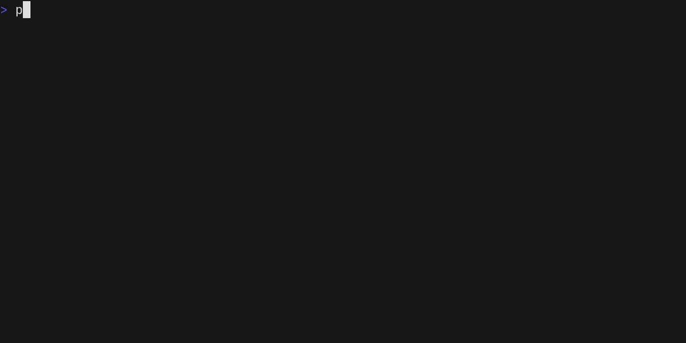

# Petra

<p>
  <br>
  <a href="https://github.com/devoteamgcloud/petra/releases"></a>
  <a href="https://github.com/devoteamgcloud/petra/actions"></a>
  <a href="https://github.com/devoteamgcloud/petra/actions"></a>
  <a href="https://github.com/devoteamgcloud/petra/actions"></a>
  <a href="https://github.com/devoteamgcloud/petra/actions"></a>
</p>

Host a Private Terraform Registry and push terraform modules to it.



### Local Machine

Follow these steps if you are OK installing and using Go on your machine.

1. Install [Go](https://golang.org/doc/install).
1. Install [Visual Studio Code](https://code.visualstudio.com/).
1. Install [Go extension](https://code.visualstudio.com/docs/languages/go).
1. Clone and open this repository.
1. `F1` -> `Go: Install/Update Tools` -> (select all) -> OK.

## Documentation

### petractl (cli)

- [petractl](petractl) - CLI to upload / remove / upload a terraform module to a private registry (Google Cloud Storage bucket).
    - example usage : 
    ```bash
    petractl push  --bucket tf-registry-petra  ../tests/mod1
    ```
**Example Usage :**


### petra (server)

- [petra]() - Server to get a terraform module versions / get a signed URL to download a module from a private registry (Google Cloud Storage bucket) configured by the following env vars :
    - `GCS_BUCKET`: bucket with terraform modules
    - `SIGNED_URL`: (Optional) Enables the use of a Signed URL for the download api routes. Defaults to false and just forwards a gcs:// link

#### Deploy Server on Cloud Run

Cloud Run's service account must have the following roles:

- Service Account Token Creator (used to create signed url)
- Storage Object Admin (access objects in bucket) for the bucket where you store the terraform modules.

Then `terraform init`:

```terraform
// main.tf
module "my_module" {
  source  = "{CLOUD_RUN_URL}/{NAMESPACE}/{MODULE}/{PROVIDER}/{VERSION}"
}
```

or specify the module version separately :

```terraform
// main.tf
module "my_module" {
  source  = "{CLOUD_RUN_URL}/{NAMESPACE}/{MODULE}/{PROVIDER}"
  version = "{VERSION}"
}
```

#### Deploy Server on GKE with Workload Identity

Activate [Workload Identity](https://cloud.google.com/kubernetes-engine/docs/how-to/workload-identity) and the service account must have the following roles:

- Service Account Token Creator (create signed url)
- Storage Object Admin (access objects in bucket) for the bucket where you store the terraform modules

Then `terraform init`:

```terraform
// main.tf
module "my_module" {
  source  = "{PETRA_SERVER}/{NAMESPACE}/{MODULE}/{PROVIDER}"
  version = "{VERSION}"
}
```

## Release

The release workflow is triggered each time a tag with `v` prefix is pushed.

_CAUTION_: Make sure to understand the consequences before you bump the major version. More info: [Go Wiki](https://github.com/golang/go/wiki/Modules#releasing-modules-v2-or-higher), [Go Blog](https://blog.golang.org/v2-go-modules).

## Maintainance

Remember to update Go version in [.github/workflows](.github/workflows)

Notable files:

- [.github/workflows](.github/workflows) - GitHub Actions workflows,
- [.github/dependabot.yml](.github/dependabot.yml) - Dependabot configuration,
- [.goreleaser.yml](.goreleaser.yml) - GoReleaser configuration,
- [go.mod](go.mod) - [Go module definition](https://github.com/golang/go/wiki/Modules#gomod),

## FAQ

### How can I customize the release or add deb/rpm/snap packages, Homebrew Tap, Scoop App Manifest etc

Take a look at GoReleaser [docs](https://goreleaser.com/customization/) as well as [its repo](https://github.com/goreleaser/goreleaser/) how it is dogfooding its functionality.

## Contributing

Simply create an issue or a pull request.